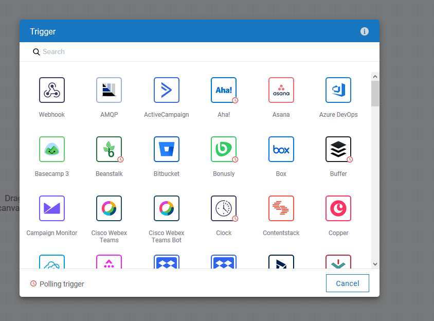
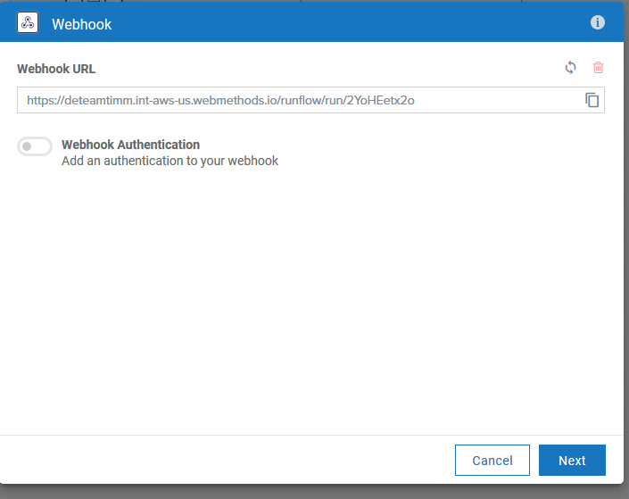
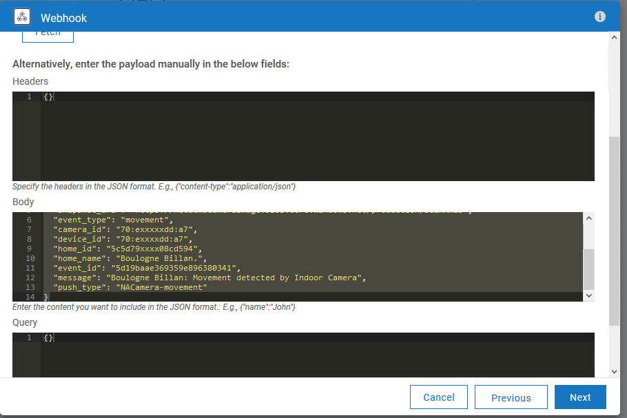
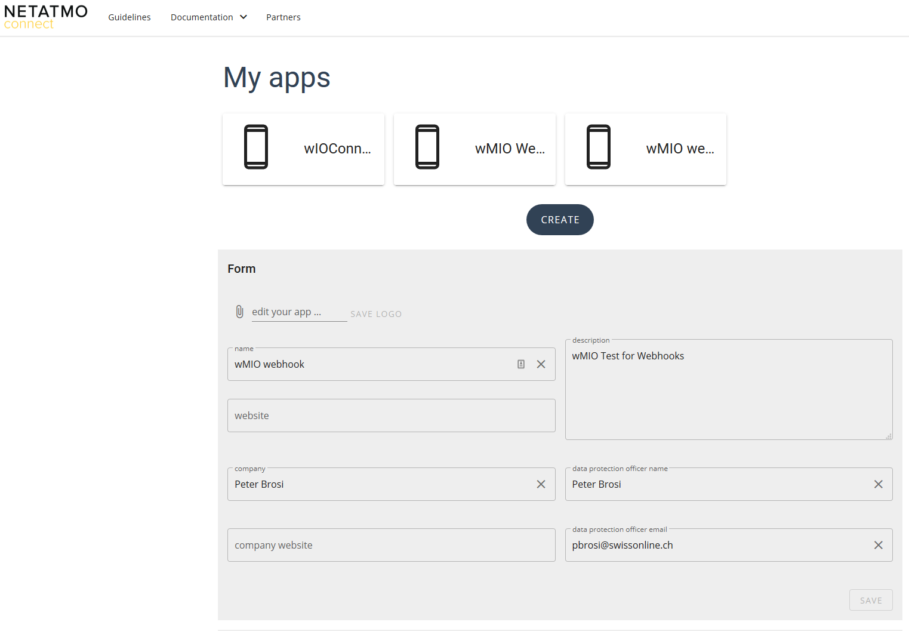
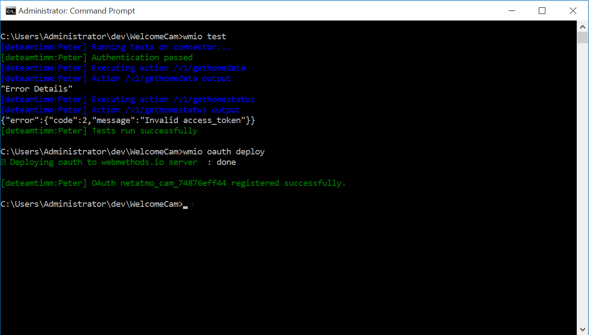

# Custom connector for Netatmo Security Camera

This is a simple home automation example based on a Netatmo security camera (custom connector) as well as an integration to Philips Hue Lighting system. 

A simple workflow is triggered by the security camera detecting a person, and if the person is recognized, the Hue lights are controlled based on the individual's profile. 

The custom connector is based on the Netatmo camera (https://www.netatmo.com) and controlled by an app available on https://dev.netatmo.com. 

## Prerequisites

To set up this example you need the following hardware devices: 
- Netatmo Security Camera:  https://www.netatmo.com/en-us/security/cam-indoor
- PHilips Hue Bridge and attached lighting: https://www2.meethue.com/en-us/starter-kits

The corresponding user accounts need to be created in the respective web applications: 
- Netatmo :  [https://dev.netatmo.com] (dev.netatmo.com)
- Philips Hue:  [https://account.meethue.com/account] (www.meethue.com)

Additionally, you need valid credentials for webMethods.io Integration - [https://www.softwareag.cloud/site/product/webmethods-io-integration.html#/](https://www.softwareag.cloud/site/product/webmethods-io-integration.html#/). 

## Create a custom connector for Netatmo security

Follow the instructions on [https://docs.webmethods.io/integration/developer_guide/connector_builder/#gsc.tab=0](https://docs.webmethods.io/integration/developer_guide/connector_builder/#gsc.tab=0) to set up the connector framework by first installing the correct node.js version and then testing it. 

To deploy the custom connector example in the directory you need to first create an app and customize the oauth.json.template file with the correct credentials. 

### Create a new workflow with a Webhook triggered

We need to first create a new workflow, triggered by a Webhook, so that we can tell Netatmo where to send event notifications. 
This workflow will get invoked by the Netatmo security camera on all relevant events, e.g. movement detection, person detection events and others. 

Copy the Webhook link created into the clipboard using the symbol at the right of the URL. 

To test the Webhook trigger, you can enter the following test data into the body of the next page: 

{
  "user_id": "5c810xxxxxxx45f4",
  "snapshot_id": "5d19bxxxxxx6380342",
  "snapshot_key": "f0134210ff83fxxxxxxxf770090a423d9a5",
  "snapshot_url": "https://netatmocameraimage.blob.core.windows.net/production/5d1xxxa5",
  "event_type": "movement",
  "camera_id": "70:exxxxxdd:a7",
  "device_id": "70:exxxxdd:a7",
  "home_id": "5c5d79xxxx08cd594",
  "home_name": "Boulogne Billan.",
  "event_id": "5d19baae369359e896380341",
  "message": "Boulogne Billan: Movement detected by Indoor Camera",
  "push_type": "NACamera-movement"
}

Connect the Trigger step to the end step and save the workflow for the moment. 

### Create a Netatmo app 

Log in to the Netatmo developer homepage at [https://dev.netatmo.com](https://dev.netatmo.com) and navigate to the myApps area.
Create a new app by providing name, description and email-id as required. 

Scrolling down to the section "App Technical Parameters", fill in the webhook URL that you have copied from your workflow trigger. 

Take a note of the client ID and client secret keys listed here. You will need these to configure the oauth file before deployment of the custom connector. 
Leave the redirect URL empty for now, we will come back to fill it out later. 

### Customize the oauth Authentication 

Edit the file oauth.json in the custom connector directory ./NetatmoSecurity. 

Fill in the client ID and secret that you have copied from the Netatmo app area replacing the text in the fields marked with <> brackets. 
Save the oauth.json file and test the consistency of the custom connector by running: 

**_wmio test_**

from the NetatmoSecurity directory.
Deploy the oauth custom authentication module by running: 

**_wmio oauth deploy_**

### Deploy the custom connector

Finish by deploying the custom connector to your webMethods.io instance. 

**_wmio deploy_**

 

